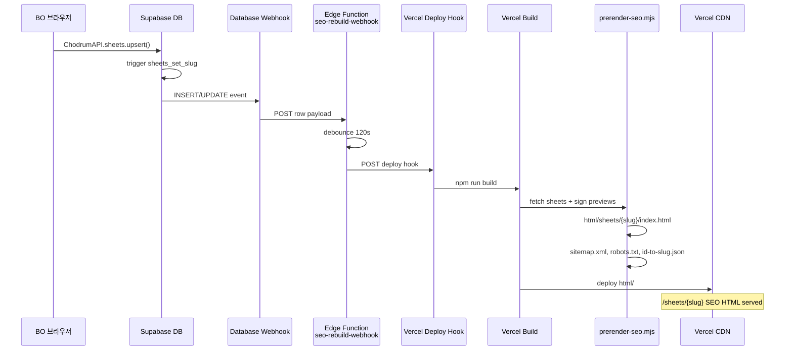

# CHODRUM SEO Step-2 설계 문서
**Prerender + Slug URL + 자동화**

> 분석 기준: `/Users/jhcho/Documents/개인 프로젝트/chodrum 2.0`  
> 스택: Static HTML shell + React 18 UMD CSR + Supabase + Vercel (`outputDirectory: html`)

---

## 1. 추천 방식 및 이유

### 결론: **하이브리드 B-primary (빌드타임 prerender + Webhook 재배포) + 최소 Edge (레거시 301만)**

| 기준 | B (빌드 prerender) | C (Edge SSR) | CHODRUM 판단 |
|------|-------------------|--------------|--------------|
| SEO 품질 | 크롤러가 즉시 HTML/meta/JSON-LD 수신 | 동일 가능 | B/C 동률, **B가 CDN 정적 serving에 유리** |
| 운영 부담 | sheet 변경 → redeploy | 런타임만 갱신 | 악보 수백~수천 규모면 **B redeploy 허용** |
| 비용 | 빌드·배포 비용 | Edge invocation 비용 | FO 트래픽 대비 **B가 예측 가능** |
| 레이턴시 | CDN 캐시 최저 | Supabase fetch + HTML 조립 | 상품 상세는 **정적이 유리** |
| HTML/CSS/JS 규칙 | 기존 CSR 유지, shell만 확장 | Edge에서 HTML 조립 필요 | **B가 기존 구조 침범 최소** |
| private preview (migration 013) | 빌드 시 service role로 sign | 요청 시 sign | og:image는 **빌드 시 sign(7일 TTL) + redeploy** |

### B를 1차, C는 Phase 3 옵션으로 두는 이유

1. **현재 배포 모델과 일치** — `vercel.json` → `html/` 정적 출력, `npm run build` → `scripts/build-jsx.mjs`만 JSX 컴파일. prerender 스크립트 추가가 자연스럽다.
2. **FO는 이미 전체 catalog hydrate** — `html/shared/api.js`의 `hydrateFromSupabase()`가 FO에서 `sheets` 전체를 fetch한다. 빌드 시 동일 데이터로 HTML head/body 스니펫 생성 가능.
3. **BO 등록 흐름 무손상** — `ChodrumAPI.sheets.upsert()` (`html/bo/BO-02-sheet-register.page.jsx` L297) 변경 없이 DB trigger로 slug 자동 생성.
4. **Edge는 이미 Supabase Functions에 있음** — `sheet-download`, `toss-confirm` 등 Deno 패턴 확립. Vercel Edge SSR 전체를 새로 두기보다, **레거시 `/sheet?id=` → 301** 정도만 `middleware.ts`로 처리.

### C(Edge SSR)를 1차로 안 하는 이유

- 레포에 Vercel `api/` / `middleware.ts` 없음. SEO 3페이지를 위해 런타임 HTML 조립 레이어를 새로 깔아야 함.
- private `sheets` bucket preview는 signed URL 필요 — SSR마다 sign 호출 → TTFB·비용 증가.
- 악보 등록 후 "즉시 검색 반영"은 webhook redeploy(2~3분)로 충분. 초 단위 실시간 SEO는 불필요.

---

## 2. URL 설계

### 신규 URL 패턴

| 페이지 | 현재 | 신규 canonical |
|--------|------|----------------|
| 홈 | `/` → `/home` | **`https://{domain}/home`** (유지) |
| 목록 | `/sheets` | **`/sheets`** (유지, meta/sitemap만 강화) |
| 상세 | `/sheet?id=s1` | **`/sheets/{slug}`** |

**상세 URL 예시** (seed 기준):

- `s2` → `/sheets/팔로우비트-한여름-밤의-셔플`
- `s1` → `/sheets/the-metronomes-snare-groove-no-7` (라틴 위주)
- 충돌 시 → `/sheets/한여름-밤의-셔플-2`

### Slug 생성 규칙

**원칙: DB trigger에서 자동 생성, BO 입력 필드 없음**

```
base = slugify(artist) + "-" + slugify(title)
slug = truncate(base, 80)  -- UTF-8 한글·영문·숫자·하이픈 허용
충돌 시: slug + "-2", "-3" … 또는 slug + "-" + lower(code)  -- code는 DS-1042 형식
```

**`slugify()` 규칙 (PostgreSQL function):**

1. NFC 정규화
2. 소문자 (영문만)
3. 공백·`_`·`.` → `-`
4. 허용: `[가-힣a-z0-9-]`, 연속 `-` 축약, 앞뒤 `-` 제거
5. 결과가 3자 미만이면 → `sheet-{code}` 또는 `sheet-{id}` fallback

**안정성 (중요):**

- **최초 INSERT 시 slug 확정**
- title/artist 수정 시 slug **기본 유지** (외부 링크·색인 URL 보호)
- `status`가 `숨김`/`판매중지`여도 slug URL은 유지하되 prerender/sitemap에서 제외 (현재 FO-03과 동일 정책)

### 하위 호환: `/sheet?id=`

| 요청 | 처리 |
|------|------|
| `/sheet?id=s1` | **301** → `/sheets/{slug}` |
| `/sheet` (id 없음) | **302** → `/sheets` |
| 알 수 없는 id | 404 shell (prerender `html/sheets/_not-found/index.html` 또는 기존 CSR Empty) |

**구현:** 빌드 시 `html/_seo/id-to-slug.json` 생성 → Vercel **`middleware.ts`** (repo root)에서 lookup 후 301.  
(vercel.json `redirects`는 정적이라 sheet 수만큼 엔트리 생성 불가)

### `fo-shared.js` PAGES 변경

```javascript
// html/fo/fo-shared.jsx
PAGES: {
  home: "/home",
  list: "/sheets",
  detail: "/sheets",  // + "/" + slug 로 조합
  detailLegacy: "/sheet", // 레거시 호환·리다이렉트용만
}
// 헬퍼 추가
sheetUrl(s) { return PAGES.detail + "/" + encodeURIComponent(s.slug || s.id); }
```

링크 전환 대상 (grep 기준):

- `SheetCard`, `SheetRow`, `index.page.jsx` 배너, `FO-05-cart`, 홈 promo 등 — `?id=` → `sheetUrl(s)`

---

## 3. DB 스키마 변경

### 신규 컬럼 (`public.sheets`)

| 컬럼 | 타입 | 용도 |
|------|------|------|
| `slug` | `text NOT NULL` (unique) | canonical URL |
| `seo_title` | `text` | `<title>` override (null이면 템플릿) |
| `seo_description` | `text` | meta description (null이면 자동) |
| `og_image_path` | `text` | Storage `preview/…` path (sign용, preview_urls[0] 미러) |

> 별도 SEO 전용 이미지 업로드는 **Phase 3**. Phase 1~2는 `preview_urls[0]` 재사용.

### Migration: `supabase/migrations/015_seo_slug.sql`

- `slugify_part`, `generate_sheet_slug` 함수
- `sheets_set_slug` BEFORE INSERT/UPDATE trigger
- 기존 행 backfill
- unique index on `slug`

### App-level vs Trigger

| | Trigger (추천) | App (`api.js` upsert) |
|--|----------------|----------------------|
| BO 변경 | **없음** | `sheetToRow` 수정 필요 |
| 일관성 | DB 단일 진실 | 클라이언트 누락 위험 |
| 기존 패턴 | `set_updated_at` trigger 존재 | upsert는 row 그대로 전송 |

**`api.js` 변경 (읽기만):**

- `mapSheet()`: `slug`, `seoTitle`, `seoDescription` 추가
- `hydrateFromSupabase()`: `D.bySlug = (slug) => …` 추가
- `sheetToRow()`: slug **보내지 않음** (trigger 위임)

---

## 4. 렌더링/메타 전략

### Initial HTML vs CSR

| 영역 | prerender (초기 HTML) | CSR (React, 기존) |
|------|----------------------|-------------------|
| `<head>` meta | **빌드 시 주입** | 변경 없음 (document.title JS 갱신 optional) |
| `<body>` `#app` | 빈 div 유지 + `data-slug`/`data-sheet-id` | 전체 UI (미리보기, YouTube, 장바구니 등) |
| `<noscript>` | h1, artist, price, 1장 preview `` | — |
| JSON-LD | `<script type="application/ld+json">` | — |

**CSR는 그대로** — React 18 UMD, `ChodrumAPI.hydrate()`, FO-03 상세 로직 유지. SEO용 스니펫은 크롤러·SNS preview용.

### 페이지별 meta 템플릿

**공통 site:** `CHODRUM` · `https://renewal.chodrum.com` (Vercel env `SITE_URL`)

#### 홈 (`html/home/index.html`)

```
title: CHODRUM — 드럼 악보 PDF 다운로드
description: 드럼 악보를 검색하고 결제 후 7일간 PDF로 다운로드하세요.
og:type: website
canonical: {SITE_URL}/home
```

#### 목록 (`html/fo/FO-02-sheet-list.html` → rewrite `/sheets`)

```
title: 드럼 악보 목록 | CHODRUM
description: 장르·난이도별 드럼 악보 카탈로그
canonical: {SITE_URL}/sheets
```

#### 상세 (`html/sheets/{slug}/index.html` — **신규 생성**)

템플릿 base: `html/fo/FO-03-sheet-detail.html` 복제

```
title: {seo_title || "{title} — {artist} | CHODRUM"}
description: {seo_description || "{artist} {title} 드럼 악보 PDF. {level} · {genre} · {pages}페이지 · ₩{price}"}
og:type: product
og:url: {SITE_URL}/sheets/{slug}
og:image: {signed preview URL, 7일 TTL}
canonical: {SITE_URL}/sheets/{slug}
```

**JSON-LD Product (schema.org):**

```json
{
  "@context": "https://schema.org",
  "@type": "Product",
  "name": "{title}",
  "description": "...",
  "image": ["{signed preview url}"],
  "brand": { "@type": "Brand", "name": "{artist}" },
  "sku": "{code}",
  "offers": {
    "@type": "Offer",
    "url": "{canonical}",
    "priceCurrency": "KRW",
    "price": "{price}",
    "availability": "https://schema.org/InStock"
  }
}
```

### prerender vs CSR-only 페이지

| 페이지 | prerender | 비고 |
|--------|-----------|------|
| `/home` | **O** (head + noscript hero) | |
| `/sheets` | **O** (head only) | 목록 본문은 CSR (필터·검색) |
| `/sheets/{slug}` | **O** (head + noscript + JSON-LD) | **핵심** |
| cart, checkout, mypage, login 등 | X | `noindex` meta 추가 권장 |
| BO 전체 | X | `robots.txt` disallow |

---

## 5. 빌드/배포 파이프라인

### `package.json` 스크립트

```json
{
  "scripts": {
    "build": "node scripts/build-jsx.mjs && node scripts/prerender-seo.mjs",
    "build:jsx": "node scripts/build-jsx.mjs",
    "prerender": "node scripts/prerender-seo.mjs"
  }
}
```

### 신규: `scripts/prerender-seo.mjs` 책임

1. **Env:** `SUPABASE_URL`, `SUPABASE_SERVICE_ROLE_KEY`, `SITE_URL` (Vercel Project Env)
2. **Fetch:** `sheets` where `status = '판매중'` + `featured_sheets`, `home_promo`, `banners` (sitemap용)
3. **Sign previews:** `storage.from('sheets').createSignedUrls(paths, 604800)` — og:image 7일
4. **Generate files:**
   - `html/sheets/{slug}/index.html` — 상세 prerender (템플릿 치환)
   - `html/home/index.html`, `html/fo/FO-02-sheet-list.html` — `<head>` 패치 (또는 `_partials/seo-head.html` include)
   - `html/sitemap.xml`
   - `html/robots.txt`
   - `html/_seo/id-to-slug.json` — middleware용
5. **실패 시:** `build` fail (SEO 없는 배포 방지)

### `sitemap.xml` 생성 규칙

```xml
/home          priority 1.0  changefreq daily
/sheets        priority 0.9  changefreq daily
/sheets/{slug} priority 0.8  changefreq weekly  lastmod = sheets.updated_at
```

`status != '판매중'` 제외.

### `robots.txt`

```
User-agent: *
Allow: /home
Allow: /sheets
Disallow: /bo/
Disallow: /cart
Disallow: /checkout
Disallow: /mypage
Disallow: /login
Sitemap: https://{domain}/sitemap.xml
```

### `vercel.json` 변경

```json
{
  "rewrites": [
    { "source": "/sheets/:slug", "destination": "/sheets/:slug/index.html" },
    { "source": "/sheet", "destination": "/fo/FO-03-sheet-detail.html" }
  ],
  "headers": [
    {
      "source": "/sheets/:slug",
      "headers": [{ "key": "Cache-Control", "value": "public, max-age=3600, stale-while-revalidate=86400" }]
    },
    {
      "source": "/sitemap.xml",
      "headers": [{ "key": "Cache-Control", "value": "public, max-age=3600" }]
    }
  ]
}
```

### Repo root: `middleware.ts` (최소 Edge)

- Path `/sheet` + query `id` → read `/_seo/id-to-slug.json` (edge config 또는 fetch static asset) → 301
- `/sheets/:slug` 파일 없음 → fallback rewrite to `FO-03` + CSR (신규 slug redeploy 전 gap)

### Vercel Env 추가

| 변수 | 용도 |
|------|------|
| `SITE_URL` | canonical, sitemap |
| `SUPABASE_SERVICE_ROLE_KEY` | 빌드 fetch + sign (**서버 only**) |
| `DEPLOY_HOOK_URL` | Supabase webhook 대상 (선택, 문서화) |

---

## 6. 자동화 흐름 (sheet 등록/수정 시 수동 작업 0)

### 트리거 이벤트

`sheets` 테이블: **INSERT, UPDATE** (status/title/preview 변경), **DELETE**

### Debounce (권장)

연속 BO 저장 시 deploy 폭주 방지 — Supabase Edge Function `seo-rebuild-webhook`:

- Database Webhook → Edge Function
- 2분 debounce 후 Vercel Deploy Hook POST 1회

### 시퀀스 다이어그램



### Supabase 설정 (운영 체크리스트)

1. Dashboard → Database Webhooks → `sheets` INSERT/UPDATE/DELETE → Edge Function URL
2. Edge secrets: `VERCEL_DEPLOY_HOOK_URL`
3. Vercel → Settings → Deploy Hooks → `seo-rebuild` 생성

**BO 코드 변경: 없음** — 기존 `upsert()` 그대로.

---

## 7. 프론트엔드 변경 범위

### `html/fo/fo-shared.jsx` / `.js`

- `PAGES.detail` → slug base path
- `sheetUrl(s)` 헬퍼
- `SheetCard`, `SheetRow` 링크 변경

### `html/fo/FO-03-sheet-detail.page.jsx`

```javascript
// URL 해석 우선순위
const slugFromPath = location.pathname.match(/^\/sheets\/([^/]+)/)?.[1];
const idFromQuery = F.qp('id');
const s = slugFromPath
  ? D.bySlug(decodeURIComponent(slugFromPath))
  : D.byId(idFromQuery);

// 레거시: id만 있고 slug 알면 replaceState (301은 middleware)
React.useEffect(() => {
  if (idFromQuery && s?.slug && !slugFromPath) {
    history.replaceState(null, '', F.sheetUrl(s));
  }
}, [s?.slug]);
```

### `html/shared/api.js`

- `mapSheet`: slug 필드
- `DrumData.bySlug` in hydrate
- (optional) `listSheets` select에 slug 포함 — 이미 `select('*')`

### `html/home/index.page.jsx`

- `bannerHref`, SheetCard 링크 → `F.sheetUrl(s)`

### BO

- **변경 없음** (slug 자동)
- (선택 Phase 3) BO 상세에 "SEO URL 미리보기" readonly 표시 — `mapped.slug`

### `html/bo/BO-02-sheet-register.page.jsx`

- save payload 변경 **불필요**

---

## 8. 단계별 구현 순서

### Phase 1 (3~4일): Slug + URL + 레거시

**산출물**

- `015_seo_slug.sql` 적용 + backfill
- `api.js` slug/bySlug
- `fo-shared` + FO-03 slug routing
- `middleware.ts` id→slug 301
- vercel.json rewrite `/sheets/:slug`

**테스트**

- [ ] BO 신규 등록 → DB `slug` 자동
- [ ] `/sheets/{slug}` CSR 정상
- [ ] `/sheet?id=s1` → 301
- [ ] 한글 slug URL 인코딩 정상
- [ ] title 중복 시 suffix

### Phase 2 (4~5일): Prerender + sitemap + 자동 deploy

**산출물**

- `scripts/prerender-seo.mjs`
- `html/sheets/{slug}/index.html` N개
- `sitemap.xml`, `robots.txt`
- Supabase webhook → Vercel Deploy Hook
- 홈/목록 head meta

**테스트**

- [ ] `curl -s /sheets/{slug} | grep 'og:title'`
- [ ] Google Rich Results Test — Product JSON-LD
- [ ] Naver 서치어드바이저 URL 제출
- [ ] BO 저장 → 3분 내 slug 페이지 meta 갱신
- [ ] `sitemap.xml` 판매중지만 포함

### Phase 3 (3~4일, 선택): Edge SSR / SEO 고도화

- Vercel Edge SSR fallback (prerender miss 시)
- `seo_title`/`seo_description` BO optional 필드
- public `og/` bucket 자동 복사 (signed URL 만료 문제 제거)
- 목록 필터 URL (`/sheets?cat=`) prerender subset

---

## 9. 리스크 & 대응

| 리스크 | 영향 | 대응 |
|--------|------|------|
| **Naver/Google 크롤** | CSR-only → 색인 약함 | prerender head + noscript + sitemap 제출 |
| **preview signed URL 만료** | og:image 깨짐 | 7일 TTL + sheet 변경/redeploy; Phase 3 public og copy |
| **Vercel deploy 한도** | Hobby 100/day | webhook debounce 2분; bulk import 시 manual 1회 deploy |
| **slug 변경** | 외부 404 | slug immutable; title 변경해도 slug 유지 |
| **redeploy 지연 2~3분** | 방금 등록 악보 | CSR는 즉시 동작; SEO HTML만 지연 — webhook |
| **build service role 노출** | 보안 | Vercel env only, 클라이언트 미포함 |
| **middleware JSON stale** | 구 id 301 실패 | build마다 `id-to-slug.json` 재생성 |
| **악보 수 급증 (1만+)** | build 시간 | Phase 3 Edge SSR 또는 incremental prerender |

---

## 10. 대안: Edge SSR 상세 (Phase 3 참고)

전면 C 전환 시 구조:

```
vercel.json rewrite:
  /sheets/:slug → /api/seo-sheet?slug=:slug

api/seo-sheet.ts (Edge):
  1. slug → Supabase anon select sheets (status=판매중)
  2. preview sign (service role, short TTL)
  3. FO-03 HTML template string replace <head> + optional body snippet
  4. Cache-Control: s-maxage=3600
  5. miss → static FO-03 fallback
```

**장점:** redeploy 없이 meta 갱신  
**단점:** Vercel Edge + Supabase per-request; 기존 "html만 배포" 모델 이탈

**CHODRUM 권장:** B로 80% 달성 후, og:image 만료나 catalog 5000+ 시 **상세만 Edge SSR**, 홈/목록은 static 유지하는 **partial hybrid**.

---

## 부록: 현재 코드베이스 핵심 참조

| 항목 | 위치 |
|------|------|
| sheets schema | `supabase/migrations/001_init.sql` + `003`~`005` |
| upsert / mapSheet | `html/shared/api.js` L177–837 |
| 상세 id query | `html/fo/FO-03-sheet-detail.page.jsx` L66 |
| PAGES.detail | `html/fo/fo-shared.js` L5–9 |
| BO save | `html/bo/BO-02-sheet-register.page.jsx` L271–306 |
| vercel rewrites | `vercel.json` L74–82 |
| build | `scripts/build-jsx.mjs` |
| Edge pattern | `supabase/functions/sheet-download/index.ts` |
| private preview | `supabase/migrations/013_storage_pdf_private.sql` |

---

이 문서를 그대로 개발자에게 전달하면 **Phase 1(slug+URL) → Phase 2(prerender+자동화)** 순으로 착수할 수 있습니다. 구현 착수 시 첫 PR은 `015_seo_slug.sql` + `api.js` slug mapping + `FO-03` slug routing부터 권장합니다.
